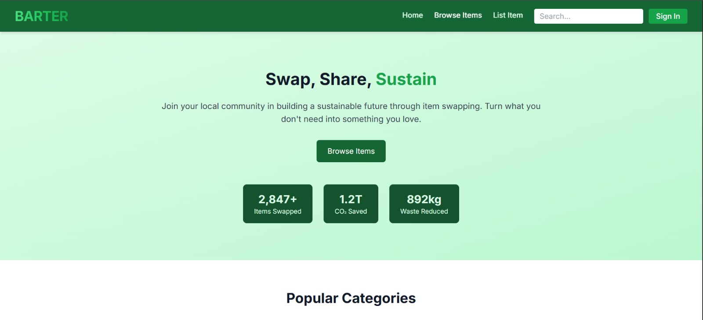
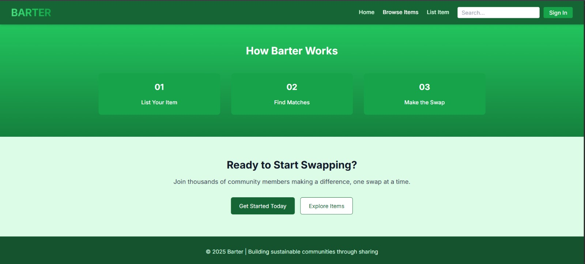
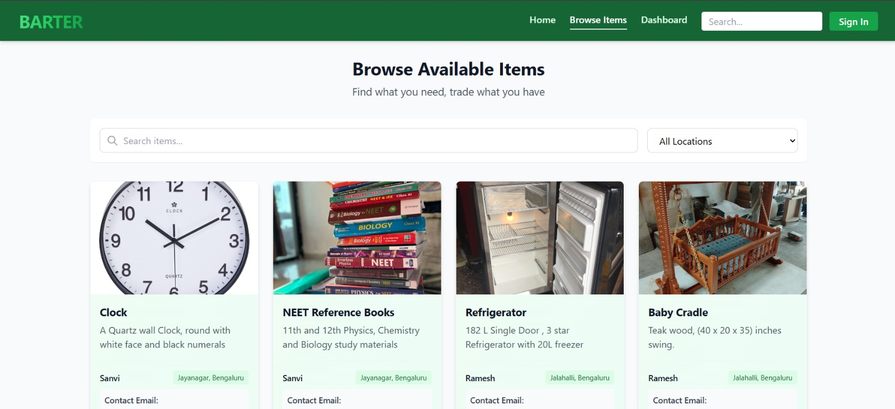

# ♻️ Barter System - Innovision

A web-based platform that allows users to **list items**, **browse listings**, and **exchange goods** through a modern digital barter system. This eliminates the need for currency-based transactions, encouraging sustainable reuse of goods.

## 📸 Screenshots

### 🏠 Home Screen

### 📊 Dashboard (Browse Items Page)

---

## 🚀 Features

- 🧾 **User Item Listing:** Users can list their unused items with title, description, and image.
- 🛍 **Browse Items:** View items listed by others with real-time updates.
- 🔄 **Barter System:** Facilitates item exchange without money.
- 🔐 **Sign In / Authentication:** (Planned/Implemented) Secure login for users to manage their listings.
- 📦 **Item Categories and Search:** (Optional) Filters for better item discovery.

---

## 🛠 Tech Stack

| Frontend | Backend | Database |
|----------|---------|----------|
| HTML, CSS, JavaScript | Node.js / Express.js | MySQL |

Other Tools:
- 🧪 Postman (for API testing)
- ☁️ Cloudinary (for image hosting)
- 📦 Multer (for file/image uploads)
- Tailwind css for styling
